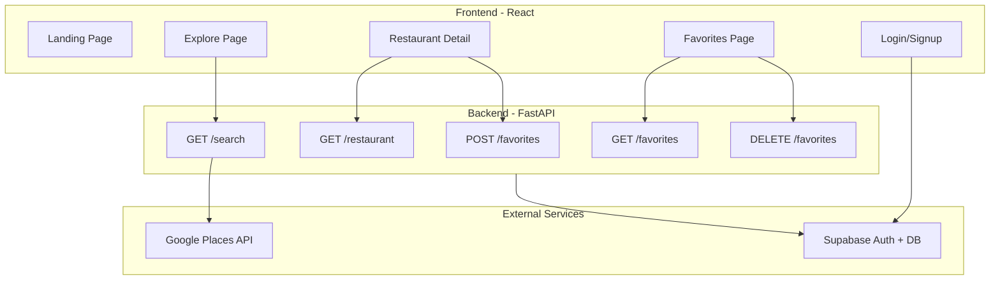

# FoodFindr MVP Implementation Plan

## Current State

- **Backend**: FastAPI with Google Places search, favorites endpoints (using SQLite locally)
- **Frontend**: Fresh React + Vite app, empty components
- **Missing**: Auth, DELETE favorites endpoint, frontend pages, Supabase integration

## Architecture Overview



---

## Phase 1: Frontend Foundation

### 1.1 Install Dependencies

```bash
npm install react-router-dom axios
```


### 1.2 Project Structure

```javascript
src/
  components/
    Navbar/Navbar.jsx
    RestaurantCard/RestaurantCard.jsx
    SearchBar/SearchBar.jsx
  pages/
    LandingPage.jsx
    ExplorePage.jsx
    RestaurantDetailPage.jsx
    FavoritesPage.jsx
    LoginPage.jsx
  services/
    api.js
  hooks/
    useGeolocation.js
  App.jsx
  App.css
  index.css
```


### 1.3 Navbar Component

- Logo/brand link to home
- Navigation links: Explore, Favorites
- Login/Logout button (conditional)
- Mobile responsive hamburger menu

### 1.4 Landing Page

- Hero section with app name and tagline
- CTA button to Explore page
- Brief feature highlights

### 1.5 Router Setup in App.jsx

- `/` - Landing page
- `/explore` - Search and browse restaurants
- `/restaurant/:placeId` - Restaurant details
- `/favorites` - User's saved restaurants
- `/login` - Login/signup page

---

## Phase 2: Core Features (No Auth)

### 2.1 API Service (`src/services/api.js`)

- `searchRestaurants(query, lat, lng)` - calls backend `/search`
- `getRestaurant(placeId)` - calls backend `/restaurant/{place_id}`
- `getFavorites(userId)` - calls backend `/favorites/{user_id}`
- `addFavorite(data)` - calls backend `POST /favorites`
- `removeFavorite(placeId)` - calls backend `DELETE /favorites/{place_id}` (after backend update)

### 2.2 useGeolocation Hook

- Get user's current lat/lng
- Handle permission denied
- Return coordinates, loading, error states

### 2.3 Explore Page

- SearchBar component at top
- Get user location on mount
- Call search API on form submit
- Display results as RestaurantCard grid
- Loading and empty states

### 2.4 RestaurantCard Component

- Photo (first from photo_urls)
- Restaurant name
- Rating with star icon
- Address (truncated)
- Open/Closed status badge
- Click navigates to detail page
- Heart icon to save to favorites

### 2.5 Restaurant Detail Page

- Fetch restaurant data by placeId from URL
- Large photo carousel or hero image
- Full name, address, rating
- Open hours if available
- "Save to Favorites" button
- Back button to explore

### 2.6 Favorites Page (localStorage first)

- Display saved restaurants as cards
- Remove button on each card
- Empty state when no favorites
- Later: sync with backend after auth

---

## Phase 3: Backend Updates

### 3.1 Add DELETE Endpoint

Add to `routes.py`:

```python
@app.delete("/favorites/{user_id}/{place_id}")
def remove_favorite(user_id: str, place_id: str, db: Session = Depends(get_db)):
    # Delete swipe record where user_id and place_id match
```


### 3.2 Refactor Terminology (Optional)

- Rename `Swipe` model to `Favorite`
- Update `swipe_direction` to just store favorites (remove left/right concept)
- Simplify endpoints

### 3.3 Connect to Supabase Postgres

- Uncomment Supabase connection in `schemas.py`
- Test database migrations
- Verify data persists

---

## Phase 4: Authentication

### 4.1 Supabase Auth Setup

- Create Supabase project (if not done)
- Enable email/password auth
- Get API keys for frontend

### 4.2 Auth Context (`src/context/AuthContext.jsx`)

- Supabase client initialization
- `user` state
- `login()`, `signup()`, `logout()` functions
- Persist session

### 4.3 Login Page

- Email and password form
- Toggle between login and signup
- Error handling and validation
- Redirect to explore after success

### 4.4 Protect Routes

- Favorites page requires auth
- Save button requires auth (or prompts login)
- Pass user_id to backend requests

### 4.5 Backend Auth Validation

- Verify Supabase JWT tokens
- Extract user_id from token instead of URL param
- Protect favorites endpoints

---

## Phase 5: Polish and Deploy

### 5.1 UI/UX Polish

- Loading spinners/skeletons
- Error toasts/messages
- Responsive design (mobile-first)
- Consistent styling across pages

### 5.2 Deploy Backend

- Railway or Render
- Set environment variables
- Connect to Supabase Postgres

### 5.3 Deploy Frontend

- Vercel or Netlify
- Set API base URL env variable
- Configure redirects for SPA routing

### 5.4 Final Testing

- End-to-end user flow
- Mobile testing
- Error scenarios

---

## File Changes Summary

### New Files to Create

| File | Purpose |

|------|---------|

| `src/pages/LandingPage.jsx` | Home/hero page |

| `src/pages/ExplorePage.jsx` | Search and browse |

| `src/pages/RestaurantDetailPage.jsx` | Single restaurant view |

| `src/pages/FavoritesPage.jsx` | Saved restaurants |

| `src/pages/LoginPage.jsx` | Auth page |

| `src/components/RestaurantCard/RestaurantCard.jsx` | Restaurant card |

| `src/components/SearchBar/SearchBar.jsx` | Search input |

| `src/services/api.js` | Backend API calls |

| `src/hooks/useGeolocation.js` | Location hook |

| `src/context/AuthContext.jsx` | Auth state (Phase 4) |

### Files to Modify

| File | Changes |

|------|---------|

| `src/App.jsx` | Add Router, routes, layout |

| `src/components/Navbar/Navbar.jsx` | Build navigation |

| `src/index.css` | Global styles, CSS variables |

| `src/App.css` | Layout styles |

| `backend/app/routes.py` | Add DELETE endpoint |

| `backend/app/database/schemas.py` | Switch to Supabase |---

## MVP Completion Checklist

- [ ] User can view landing page
- [ ] User can search for restaurants
- [ ] User can view restaurant details
- [ ] User can save favorites (localStorage)
- [ ] User can view and remove favorites
- [ ] User can log in/sign up
- [ ] Favorites sync with backend